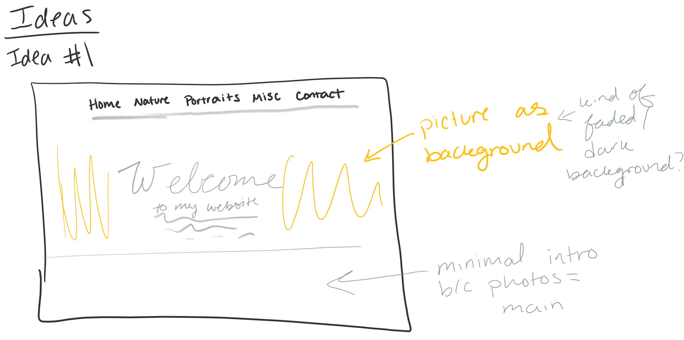
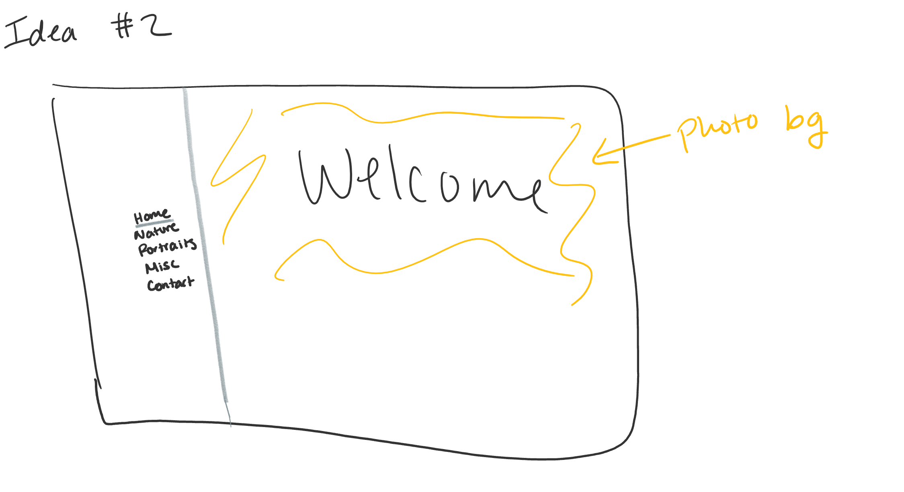
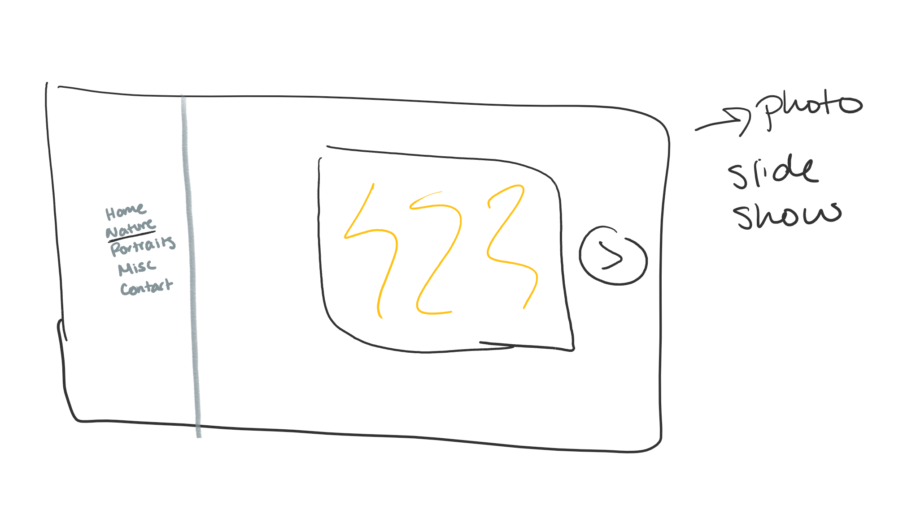
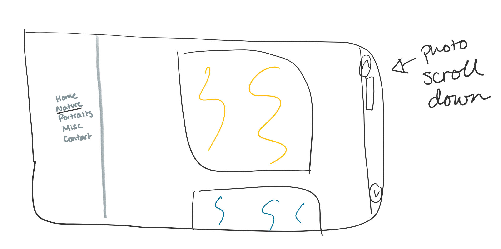
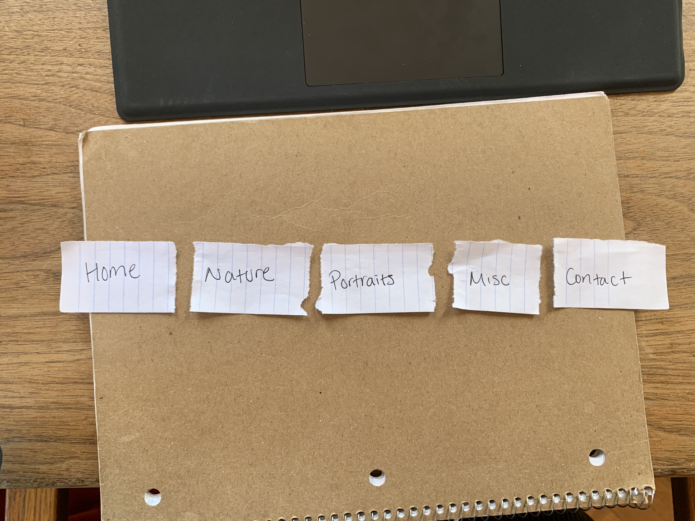
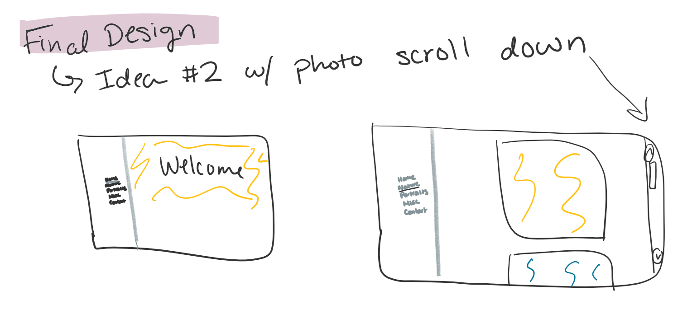
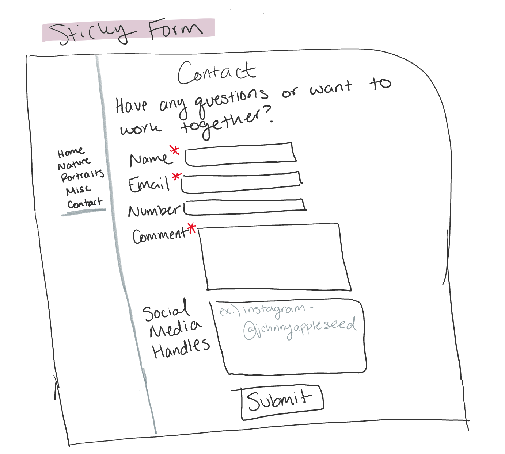
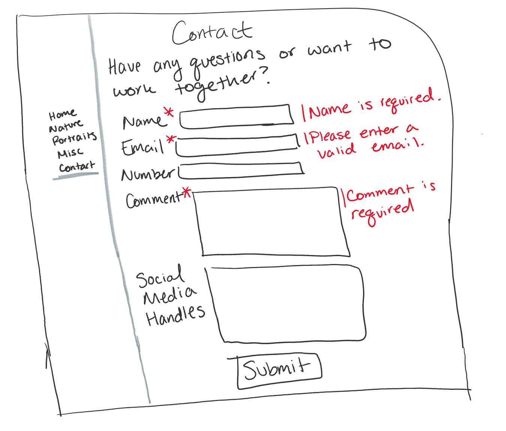

# Project 1: Design Journey

Your Name: [Hahnbee Lee]

**All images must be visible in Markdown Preview. No credit will be provided for images in your repository that are not properly linked in Markdown. Assume all file paths are case sensitive!**

# Project 1, Milestone 1 - Design & Plan

## Website Topic

[Tell us what your website is about. What are you promoting?]
My website will be promoting my photography and have multiple tabs promoting different types of photos that I have taken.

## Target Audiences

[Tell us about your two target audiences.]
* My first target audience are Instagram users that are interested in seeing past what is on my Instagram. To describe these people more in detail these people are just interested in seeeing into pictures of my personal life.

* My second target audience are artistic friends that have a noticable interest in photography. These people understand photography and will be more interested in the aesthetic of the site that must compliment the pictures. Additionally, they may be interested in collaborating or providing constructive criticism - which is what the form is for.

## Design Process

[Document your design process. Show us your sketches. Show us your card sorting. Show us the evolution of your design from your first idea (sketch) to design you wish to implement (sketch). Show us the process you used to organize content and plan the navigation (card sorting).]

[Thoroughly document this process. The _process_ is the important part of this assignment, not the final result.]

first idea

second idea

card sort

## Final Design Plan

[Include sketches of your final design here. Don't forget to design the form and its confirmation page!]

final design

form

errors

[Include your site navigation here. Describe the content on each page. Tip: use bulleted lists.]
* Home - a welcome page with very minimal information about me because the main focus is the photography. Behind the very short introduction one of the photos will be in the background
* Nature
    - photos I took of nature
    - is the 2nd tab because I have the most of these types of photos
* Portraits
    - photos of people
    - 3rd tab bc people are interested in portraits
* Misc
    - pictures of museums, objects, art
    - basically anything that isn't a portrait or nature
* Contact
    - all my social media
    - a form for any type of inquiries
## Target Audiences' Needs

[Tell us how your design meets the needs of both of your target audiences.]

My design meets the needs of people visiting my Instagram and artistic friends interested in photography because for both audiences want a focus on the aesthetic of my photos. Whether they want an extension of what goes on in my life (Instagram) or more of my artistic side they are both there for photographs. Therefore the simple, minimalist design will satisfy both audiences.
## Templates

[Now that you've finalized your design, identify the templates you will use on your site.]
- header - includes nav bar and title of site
- footer - copyright claiming all the pictures as mine and links to my social media

# Project 1, Milestone 2 - Draft Website

## Sticky Form

[What fields are required for your form?]
* Name
* Email
* Comment

[Plan out your error messages for your target audiences here.]
"Name is required."
"Please enter a valid email."
"Comment is required."
## Validation Code Plan

[Write out your pseudocode plan for handling the validation of the form.]
If name is empty
    print "Name is required."
If email is empty or not a valid email
    print "Please enter a valid email."
If comment section is empty
    print "Comment is required."

# Final Submission: Complete & Polished Website

## Target Audiences

[Tell us how your final site meets the needs of the target audiences. Be specific here. Tell us how you tailored your design, content, etc. to make your website usable by both target audiences.]

 My final site meets the needs of my target audience because the design is minimalistic and focuses on the photography. The color scheme is light so that it sets a clean background for the photos.

 As for the content there is very minimal content because the focus is the photos and not much description is needed for this purpose which is why there is only a short introduction on the home page and a contact page for anyone who would like to provide feedback for the photos or requests for collaboration.

 The website is also specifically useful for my two target audiences because the photo pages are set up in an instragram-like fashion and as for the artistic friends they'll be able to get a clear view of the photos themselves without anything distracting them such as comments or likes.

 The contact page is useful for my target audiences because of its versitality. It is very universal because it doesn't specify what kind of comment might be made. It suits the more casual Instagram audience because they can just comment whatever they want if they desire to say something specifically about the photos on the site. But, it also suits the more artistically professional audience because they can utilize it to ask about collaboration and/or equipment/editting questions.
## Reflection

[Take this time to reflect on what you learned during this assignment. How have you improved from 1300? What things did you have trouble with?]

In this assignment I...
* got used to Visual Studio Code
* implemented a side nav bar for the first time
* used fixed elements
* used names of images efficiently by printing them using a foreach loop
* implemented php for the first time

I improved from 1300 by...
* making a lot more aesthetically pleasing site

I had trouble with...
* padding/margins
