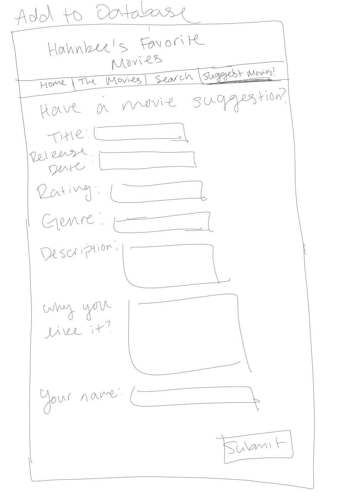

# Project 2: Design Journey

Your Name: [Hahnbee Lee]

**All images must be visible in Markdown Preview. No credit will be provided for images in your repository that are not properly linked in Markdown. Assume all file paths are case sensitive!**

# Project 2, Milestone 1 - Design, Plan, & Draft Website

## Describe your Catalog

[What will your collection be about? What types of attributes will you keep track of for the *things* in your collection? 1-2 sentences.]
My collection will be a list of my favorite movies. For the attributes I will include release date, genre, rotten tomatoes rating, a little description about what the movie is about, and my personal opinion on why I like the movie.

## Target Audiences

[Tell us about your target audience(s).]
My target audience is friends and family who are interested in knowing what my favorite movies are. If I were to get an actual domain for this website I would share it with friends and family who I am close with and want to share the intimate knowledge of my favorite movies with them.
Through my website they will need to gain a general summary and details of the movie such as the title, release date, rotten tomatoes percentage, and genre. In addition to the general details of the movie, they will also want to hear my opinion because they are my friends and want to know how I personally felt.

## Design Process

[Document your design process. Show us the evolution of your design from your first idea (sketch) to design you wish to implement (sketch). Show us the process you used to organize content and plan the navigation (card sorting).]

[Label all images. All labels must be visible in Markdown Preview.]

Sketch 1

Sketch 2

Sketch 3

Sketch 4

Navigation Design

Card Sort
## Final Design Plan

[Include sketches of your final design here.]

## Templates

[Identify the templates you will use on your site.]
- The nav bar will be a template used on every page.
- functions that i reuse in the pages will be all in one template so that i don't have to copy paste the function into every page
- The head will be in a template

## Database Schema Design

[Describe the structure of your database. You may use words or a picture. A bulleted list is probably the simplest way to do this. Make sure you include constraints for each field.]

Table: movies
* id - Integer - N, P, A, U - key to identify the different movies solely in the table
* name - Text - N - Title of the movie
* release_date - Text - release date of the movie
* rating - Integer - rating on rotten tomatoes of the movie
* genre - Integer - genre of movie distinguished my number which stands for a genre
* description - Text - description/ information about the movie
* opinion - Text - N - my personal opinion of why i like the movie

## Database Query Plan

[Plan your database queries. You may use natural language, pseudocode, or SQL.]
describing what your database is going to look at

1. All records

SELECT * FROM movies;
//all of the movies I personally inserted
for(up till the eighth element){
    will print out all fields except id. This includes name, release date, rating, genre, description and opinion.
}

//all the movies that the audience inserted for their own opinion on the movies that I like
after the 7th element{
    print out only name and opinion
}

2. Search records
if search is valid{
    SELECT * FROM movies WHERE $search_field LIKE '%' || :search || '%';
}else{
    SELECT * FROM movies; //show all entries if there are no entries that satisfy the search
}

^this searches all of my entries along with other people's opinions. When the search is done...
if the result is from my entry
    then it will show name, date, rating, genre, description, and opinion.
if the result is from other people's opinions
    then it will show only name and opinion
if there are multiple results from both my entry and other people's opinions
    then it will show both tables - the one with all the info and one with only the title and opinion

3. Insert record
    INSERT INTO movies('name', 'opinion') VALUES(:movie_name, :opinion);

    opinion will only have title of movie and the person's comment because re-putting all of the information would be redundent.

    other people's opinion - show only entries after entry 7 (my entries)

## Code Planning

[Plan any PHP code you'll need here.]
    SELECT * FROM movies;

    SELECT * FROM movies WHERE $search_field LIKE '%' || :search || '%';

    INSERT INTO movies('name', 'opinion') VALUES(:movie_name, :opinion);

# Final Submission: Complete & Polished Website

## Reflection

[Take this time to reflect on what you learned during this assignment. How have you improved since Project 1? What things did you have trouble with?]

I've learned the importance of using functions and using templates to use them on all my pages. We've been using the init.php but I never really looked into it or implemented functions through a template like we did here.

I took pride in using the id of my movies for indices for my arrays so that I can eject my movie poster and sources for it.

I also figured out how to kind of make it look like there are two tables even though there is only one table.
