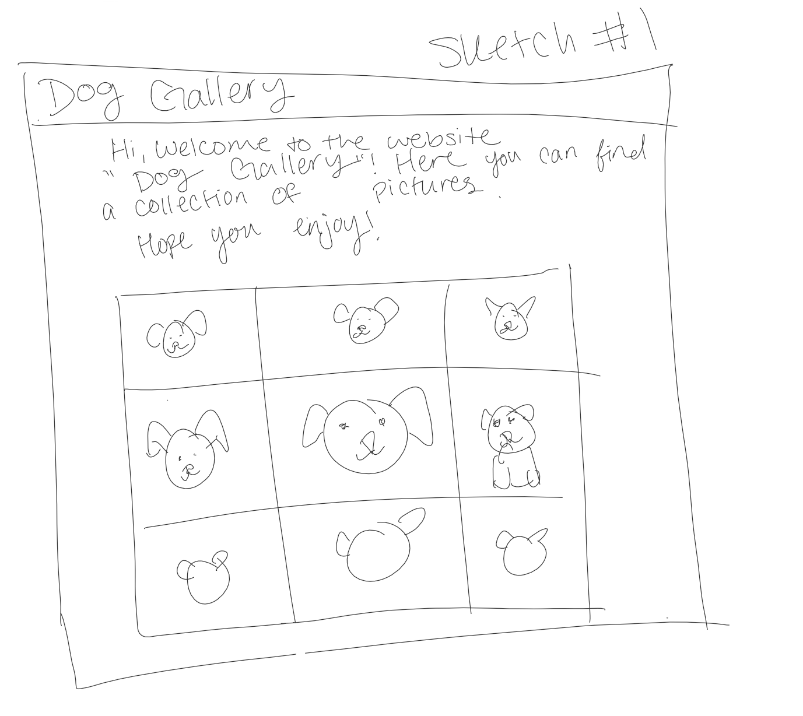
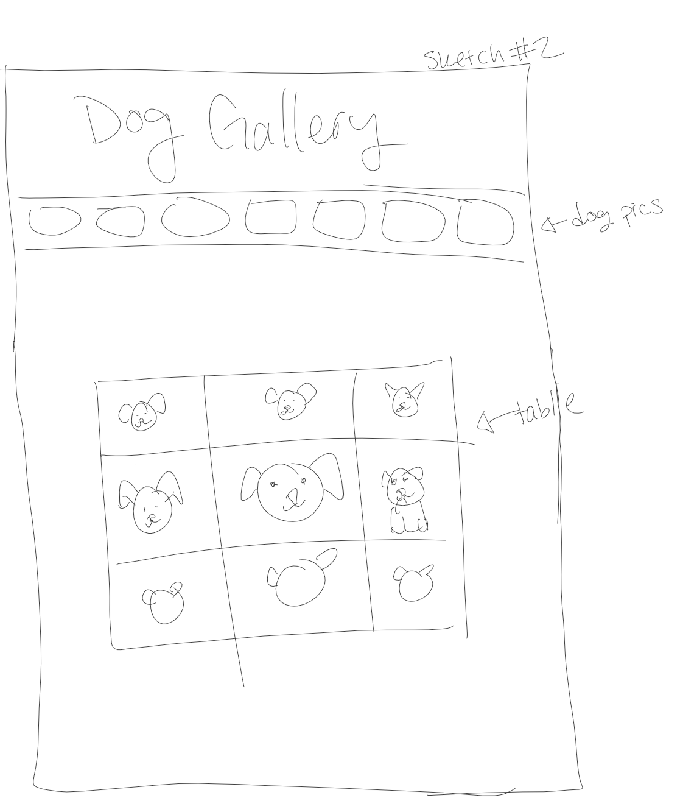
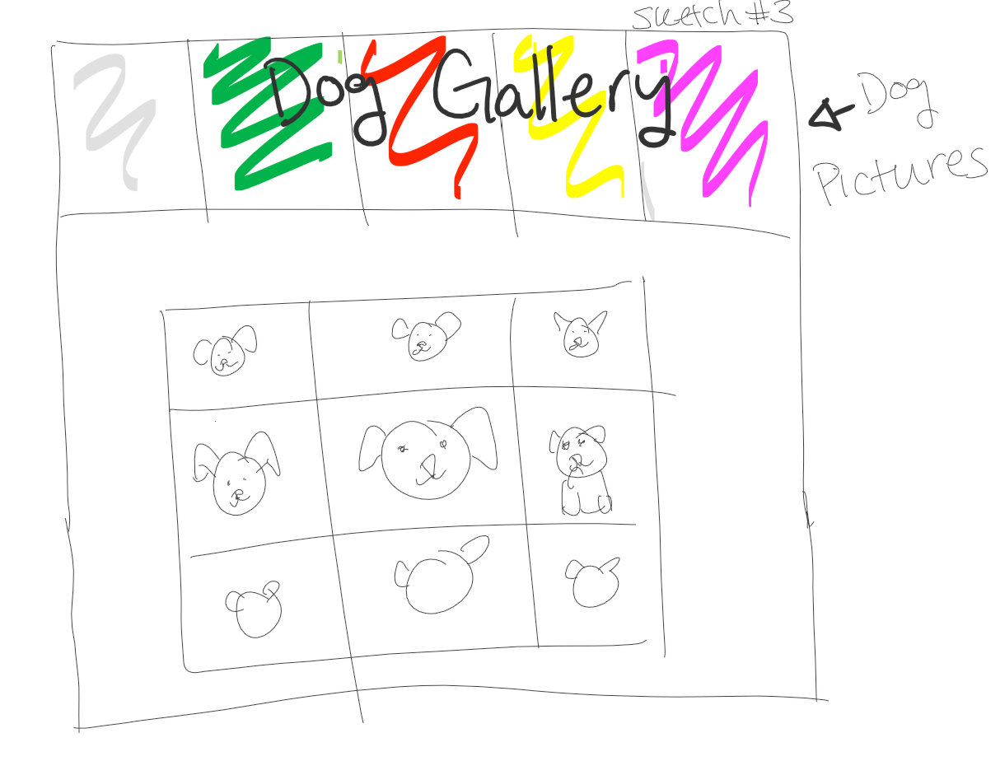
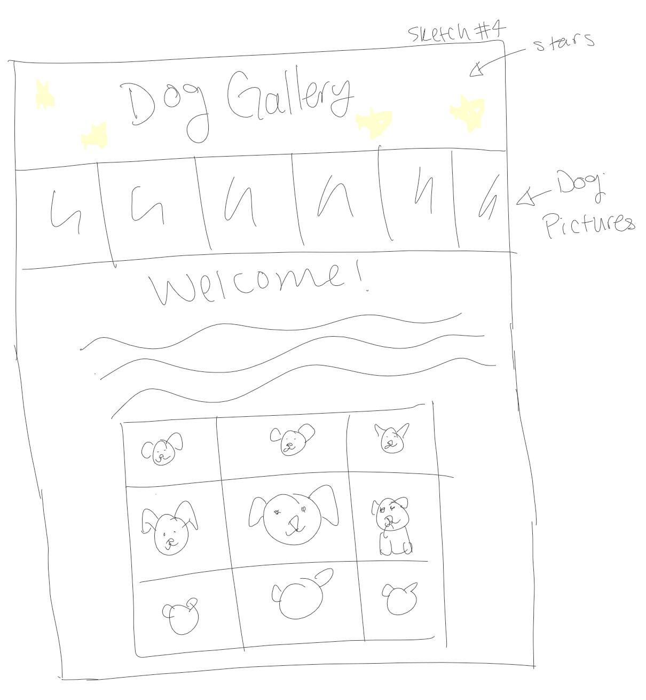
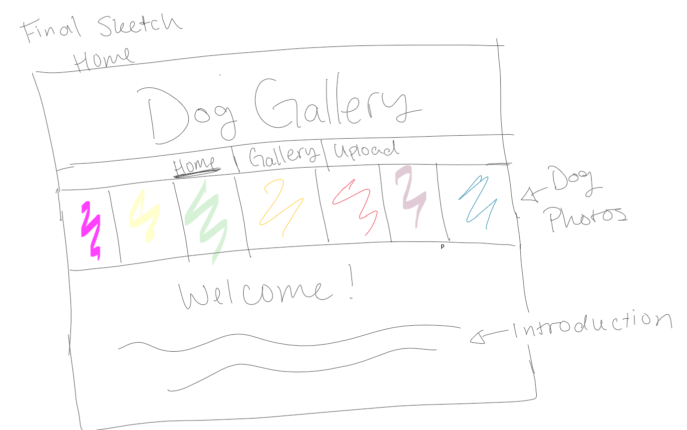
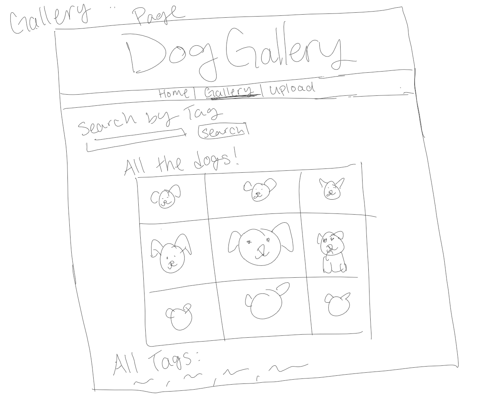

# Project 3: Design Journey

Your Name: [Hahnbee Lee]

**All images must be visible in Markdown Preview. No credit will be provided for images in your repository that are not properly linked in Markdown. Assume all file paths are case sensitive!**


# Project 3, Milestone 1 - Design, Plan, & Draft Website

## Describe your Gallery

[What will your gallery be about? 1 sentence.]
My gallery will consist of pictures of cute dogs.

## Target Audiences

[Tell us about your target two audiences. ~1-3 sentences per audience]
1. People who really like dogs is my first target audience. They want to see pictures of them and they have in mind what they want to see. Their needs are just an organized display of dogs.

2. Dog owners who want to post pictures of their dogs in a community is the second target audience. They are using the site mostly as a social media platform for sharing their pictures of their dogs and seeing other owners' pictures of their dogs. Their needs from the website is that it acts as a community of dog owners and lovers that can share their photos; they need an outlet to share their love for their pet with others.
## Design Process

[Document your design process. Show us the evolution of your design from your first idea (sketch) to design you wish to implement (sketch). Show us the process you used to organize content and plan the navigation (e.g. card sorting).]

[Label all images. All labels must be visible in Markdown Preview.]

;
;
;
;

## Final Design Plan

[Include sketches of your final design here.]
;
;
;
;
;
;
;


## Templates

[Identify the templates you will use on your site.]
nav bar (header)
head
functions that will be reused in multiple pages
login.php
## Database Schema Design

[Describe the structure of your database. You may use words or a picture. A bulleted list is probably the simplest way to do this. Make sure you include constraints for each field.]

[Hint: You probably need `users`, `images`, `tags`, and `image_tags` tables.]

[Hint: For foreign keys, use the singular name of the table + _id. For example: 1) `user_id` in the `images` table or 2) `image_id` and `tag_id` for the `image_tags` table.]


```
users (
id : INTEGER {PK, U, Not, AI} -- surrogate primary key
username: TEXT{Not}
password: TEXT{Not}
)
```

```
images (
id : INTEGER {PK, U, Not, AI} -- surrogate primary key
ext: TEXT {Not}
name: TEXT {Not}
user_id: INTEGER -- foreign key
)
```

```
tags (
id : INTEGER {PK, U, Not, AI} -- surrogate primary key
tag: TEXT {Not, U}
)
```

  ```
image_tags (
id : INTEGER {PK, U, Not, AI} -- surrogate primary key
image_id: INTEGER {Not} -- foreign key
tag_id: INTEGER -- foreign key
)
```

```
sessions (
id : INTEGER {PK, U, Not, AI} -- surrogate primary key
user_id: INTEGER {Not}, -- foreign key
session: TEXT {Not, unique}
)
```

## Code Planning

[Plan what top level PHP pages you'll need.]
index.php
gallery.php
image.php
upload.php

[Plan what templates you'll need.]
nav bar (header)
head
functions that will be reused in multiple pages
login.php

[Plan any PHP code you'll need.]
```
function print_images_table($images){
$i =1;
for ( $images as $image){
  if ($i % 3 == 0){
    print_image($image);
    print new row
    $i++
  }else{
    print_image($image);
  }
}
}


```
Example:
```
function is_user_logged_in() {
  if user is logged in, return true
  otherwise, return false
}

// Show logout, only if user is logged in.
if user is logged in (is_user_logged_in()) then
  show logout link
else
  show login link
end
```


## Database Query Plan

[Plan your database queries. You may use natural language, pseudocode, or SQL.]
1. All records

SELECT * FROM images;
//seed data PLUS data inserted by users
set $i = 1 and increment after every photo
when $i = 3 create new row

2. Search records
if search is valid{
    SELECT DISTINCT images.id, images.description, images.ext, images.id, tags.tag, images.source FROM images INNER JOIN image_tags ON image_tags.image_id = images.id INNER JOIN tags ON tags.id = tag_id WHERE tags.tag LIKE '%' || :search || '%'
}else{
    SELECT * FROM images; //show all entries if there are no entries that satisfy the search
}

3. Insert record
    INSERT INTO images (description, ext, source, user_id) VALUES (:description, :file_ext, :source, :user_id);
4. Delete record
  DELETE FROM images WHERE id = :id;
  DELETE FROM image_tags WHERE image_id = :id;

"Photo Gallery" and "User Access Controls"
# Project 3, Milestone 2 - Gallery and User Access Controls

## Issues & Challenges

[Tell us about any issues or challenges you faced while trying to complete milestone 2. 2-4 sentences/bullet points]
* I'm having trouble getting the pictures to pop up in another page because I don't know how to send information from one page to another. Currently, I am using a GET form but it is not working. Professor Harms told me to use http_build_query() and I need to figure out how it works.
* I had trouble implementing logging into my website, but it turned out it was just a variable with a typo.
* I can't get the uploading to work. I had an extra parameter.

# Final Submission: Complete & Polished Website

## Reflection

[Take this time to reflect on what you learned during this assignment. How have you improved since starting this class? 2-4 sentences]
There were many moments where I needed to reuse functions but change one thing to them and it was redundent to copy paste the whole function with one line of code added so I initally tried fixing this problem by passing parameters but I later realized that this technique was bad because you still had to alter all the paramters for all the related functions so next time I want to implement if statements within the functions instead of passing parameters.
